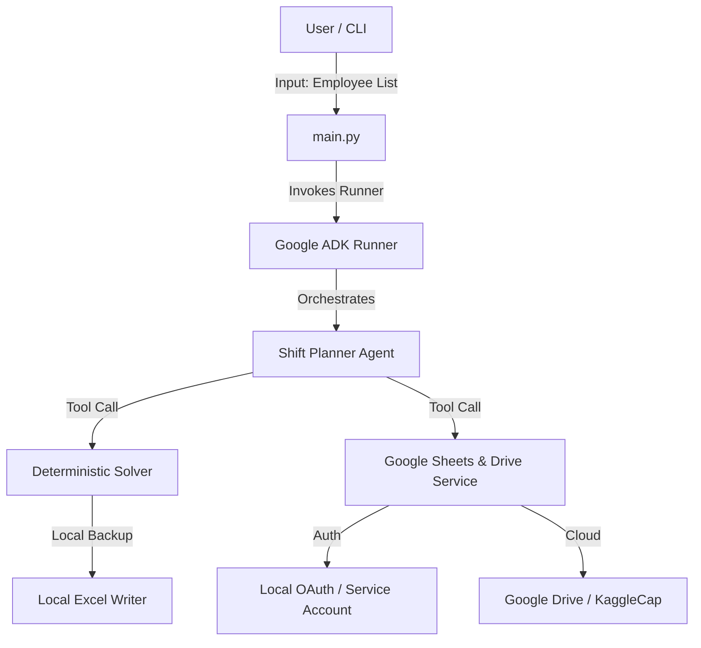

# Architecting a Hybrid Shift Planner: Marrying Deterministic Solvers with Agentic AI

*Author: Solutions Architect*

In enterprise systems design, resource scheduling is a classic, yet notoriously complex, constraint-satisfaction problem (CSP). Balancing operational demands, regulatory constraints, and employee welfare requirements (such as mandated weekoffs) typically leads to a combinatorial explosion of states. 

Recently, there has been a push to solve these scheduling problems using Generative AI. However, relying purely on Large Language Models (LLMs) for strict mathematical and logical tasks (like scheduling or counting days) is risky due to the stochastic nature of token prediction. 

In this post, I will share the architecture of **ShiftPlanner**, a system designed to solve shift allocation for offshore engineering teams. This system successfully marries a **deterministic CSP solver** with **agentic orchestration** using Google's **Agent Development Kit (ADK)** and the **Gemini** model family.

---

## The Challenge: Multi-Dimensional Constraints

The system was designed to schedule shifts for an offshore team under the following strict operational rules:
1. **Shift Timings**: Support for two overlapping shifts in IST: `Shift 1 (07:00 - 15:00)` and `Shift 2 (12:00 - 20:00)`.
2. **Work-Life Balance**: Every employee must receive exactly **two off-days (weekoffs)** per week.
3. **Sunday Standby**: On Sundays, coverage needs to drop to exactly **one employee per shift** (1 in Shift 1, 1 in Shift 2) to maintain essential operations, while the rest of the team remains off.
4. **Balanced Weekdays**: Weekday shifts must be distributed as evenly as possible across the team to prevent burnout and ensure fair utilization.

---

## High-Level System Architecture

A clean, modular architecture was selected to separate the cognitive interface from the algorithmic execution and integration boundaries:

### 1. The Core Solver (Algorithmic Determinism)
At the heart of the application is a Python-based backtracking solver ([solver.py](file:///f:/Senthil/Projects/SubaPOC/ShiftAllocationProject/shift_planner/solver.py)). Rather than asking an LLM to generate schedules (where it might lose count of weekoffs or violate coverage rules), the solver uses constraint propagation.
- It models the week as a grid and recursively assigns `Shift1`, `Shift2`, or `Weekoff`.
- At each step, it validates local constraints (e.g., ensuring Sunday doesn't exceed 2 working employees and weekday off-days stay within the balanced range $\lfloor(N+2)/6\rfloor$).
- This guarantees **100% compliance** with operational constraints.

### 2. The Cognitive Orchestration Layer (Google ADK)
We used Google's **Agent Development Kit (ADK)** ([agent.py](file:///f:/Senthil/Projects/SubaPOC/ShiftAllocationProject/shift_planner/agent.py)) to wrap the solver and integration tools. 
- The ADK Agent is configured with specialized instructions and tools.
- It receives the user prompt, coordinates the execution of the solver, uploads the result to Google Drive, and calls Gemini to format a natural language summary explaining the schedule's constraints back to the team.

### 3. Integration & Fallback Strategy (Sheets & Excel)
Enterprise applications must be resilient to API credential failures. The integration layer ([sheets_helper.py](file:///f:/Senthil/Projects/SubaPOC/ShiftAllocationProject/shift_planner/sheets_helper.py)) implements a dual strategy:
- **Cloud-Native Target**: Uses `gspread` and the Google Drive API to search for or create a folder named `KaggleCap` on Google Drive, create a spreadsheet `Shift_Details_jul_2026`, and write the pivoted schedule.
- **Local Fallback**: If credentials are missing, the system falls back to creating a heavily styled Excel (`.xlsx`) sheet locally using `openpyxl`, applying conditional formatting (highlighting `Weekoff` cells in **RED**), auto-fitting column widths, and applying clean fonts.

---

## Architectural Lessons Learned

### 1. Hybrid AI Patterns (Deterministic + Agentic)
One of the most important architectural decisions was avoiding the use of LLMs for generating raw tabular schedule records. Instead, we used a hybrid model:
- **Deterministic Code** does the heavy lifting where accuracy is absolute (solving constraints, mathematical modeling, and spreadsheet formatting).
- **Agentic AI** handles user interaction, orchestration, and cognitive summaries (explaining schedules, managing intent, and acting as a middleware).

### 2. Local/Remote Equivalence
By designing a local `.xlsx` fallback, the program remains fully functional in sandboxed environments without requiring cloud network egress or API secrets during local testing.

---

## Conclusion

By isolating constraints inside a robust Python solver and leveraging Google ADK's tool execution framework, we built a shift planner that is both **computationally correct** and **naturally interactive**. 

The code has been pushed to a remote GitHub repository at https://github.com/subasen85/ShiftPlanner, demonstrating how clean software design patterns can pave the way for successful AI agent integrations.
